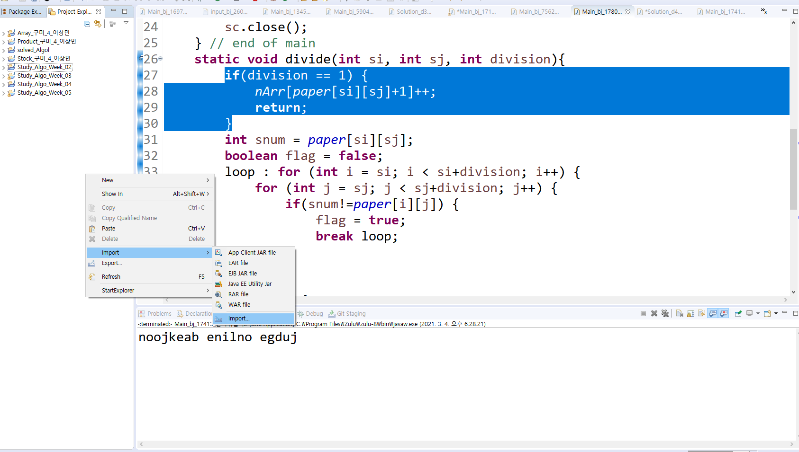
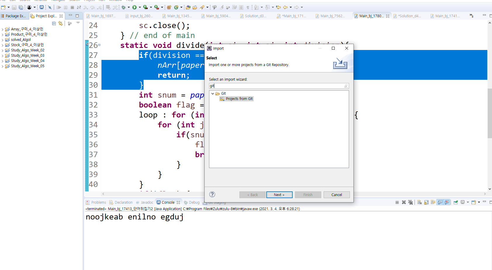
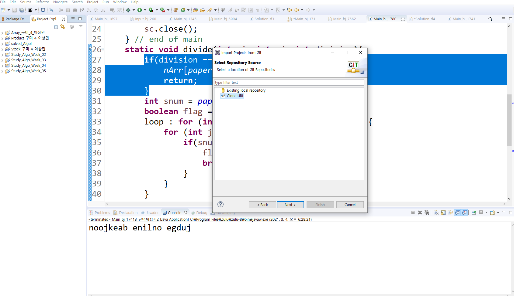
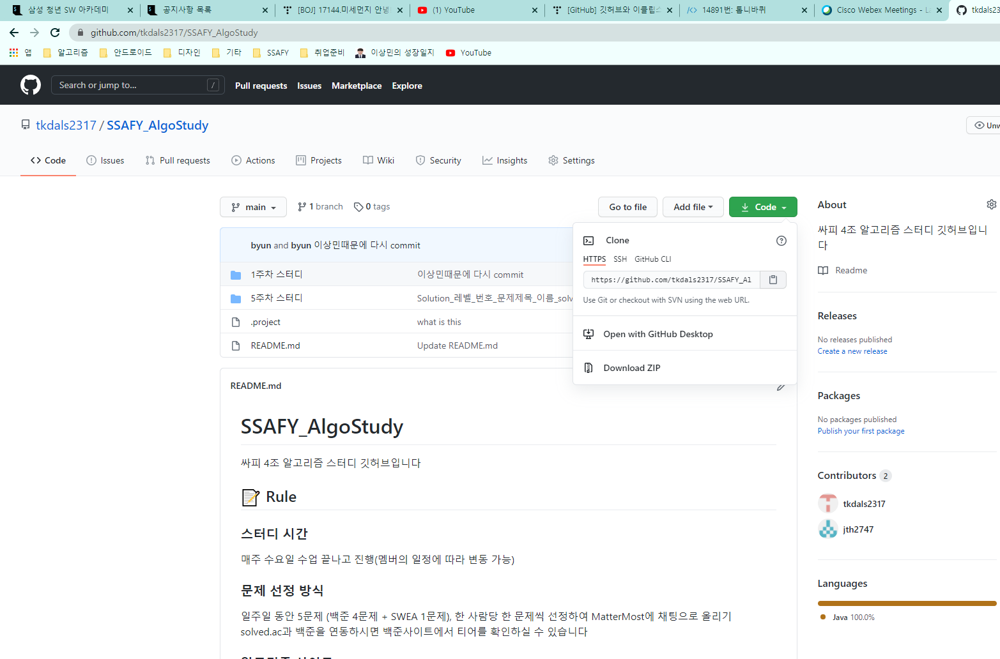
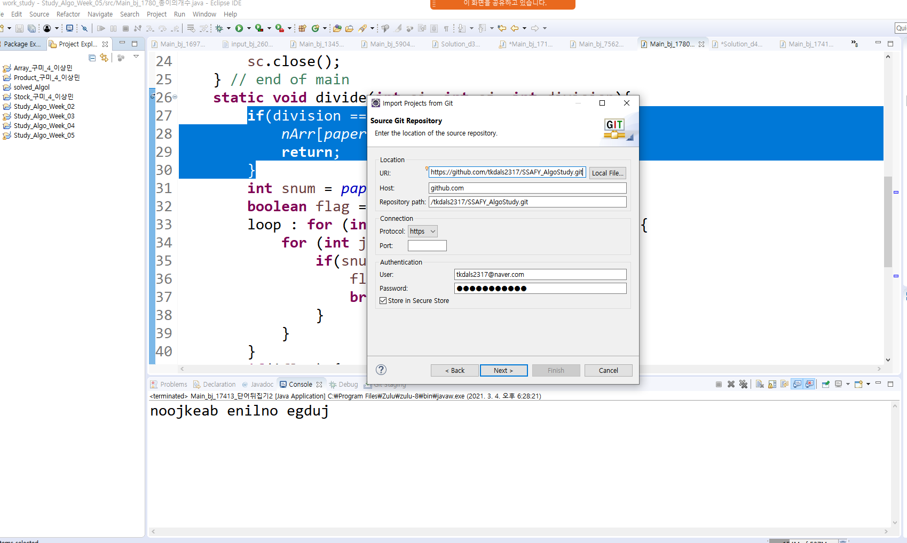
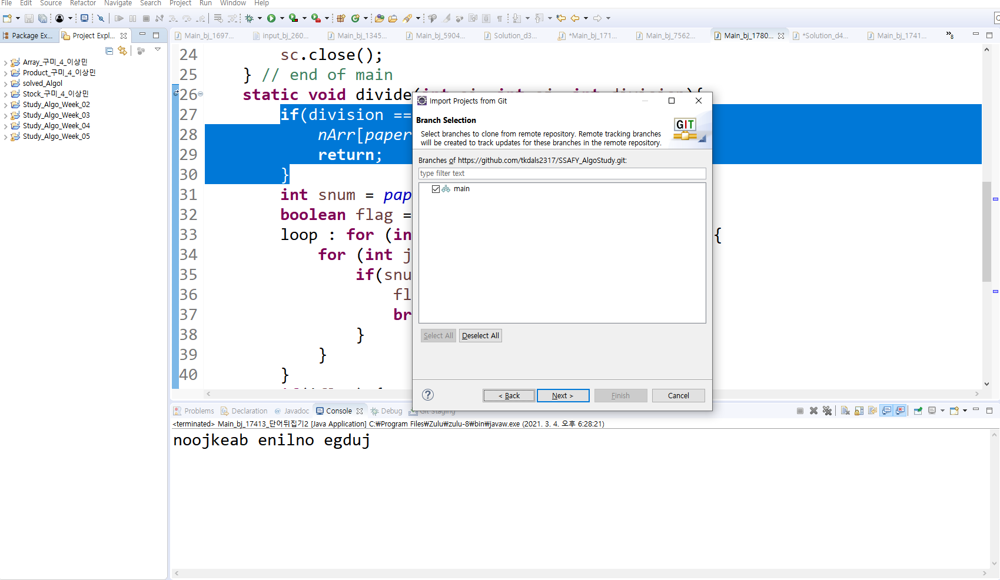
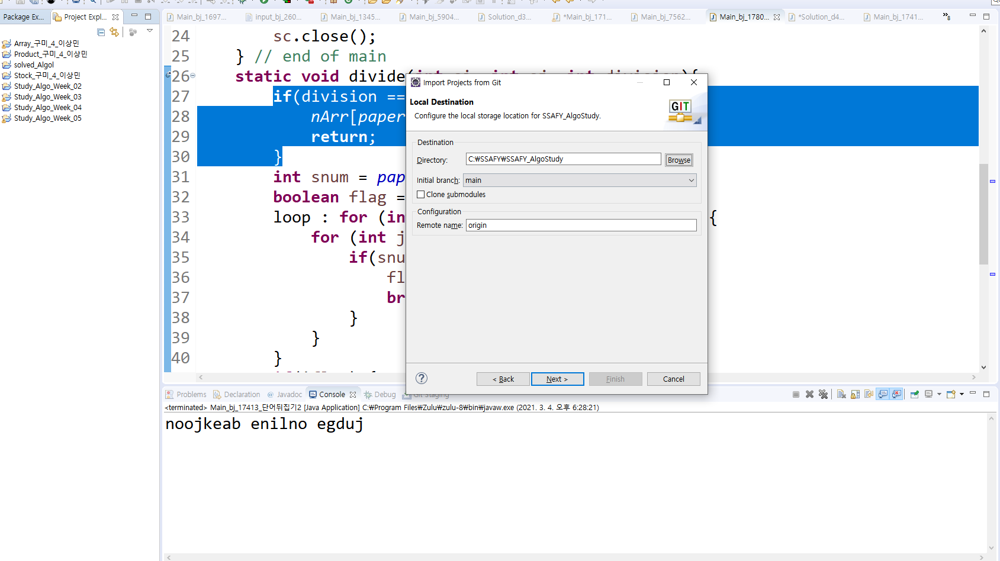
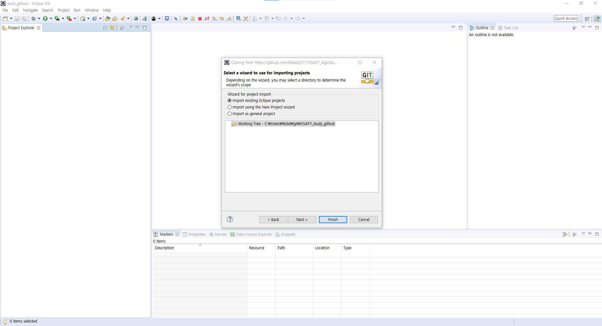
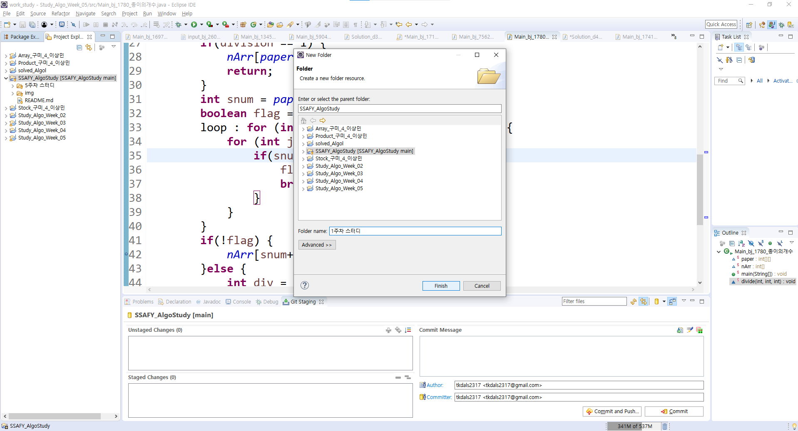
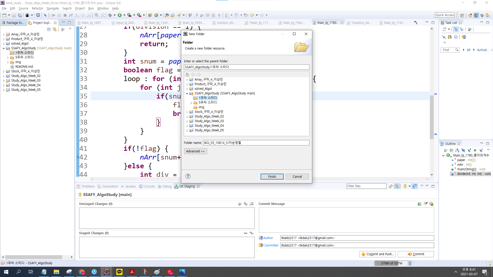

### SSAFY 3반 알고리즘 스터디 화이팅

# 📝Rule

#### ⏰스터디 시간 
- ##### 매주 토요일 7시 코드 리뷰
- ##### 화요일/목요일 7시부터 모여서 알고리즘 풀기      


 
#### ✏️스터디 문제

- ##### [공통 문제 5개](https://www.acmicpc.net/group/workbook/list/9987)
- ##### 자유 문제 5개
###
# 💡공유방법

##### 매주 새 디렉터리를 만들고,(ex 8주차, 9주차...)
##### 새 디렉터리에 문제 디렉터리를 만듭니다.
##### 문제 디렉터리에 각자 푼 문제를 추가합니다.
##

##### 파일 생성 및 업로드 규칙
 N주차/디렉터리/.java파일로 해서 추가합니다.
 
 -ex) 8주차/bj_2876/Main_2876_이름
 
###
# 🛑 push 하는 법
 
 ##
 :apple: How to Contribute  1️⃣
---
1. 사용하고자 하는 워크스페이스의 프로젝트 익스플로러에서 import(왠만하면 스터디 문제 푸는 워크스페이스에서 하시길 권장합니다, 안그럼 옮길 때 귀찮아요~:open_mouth:) 
 


2. git 검색 projects from Git 클릭 후 Next



3. Clone URI 선택 후 Next



4. 스터디 깃허브 사이트에 Code 누른 후 URI 복사



5. 복사한 URI를 붙혀넣고 사용할 이메일과 비밀번호 기입 후 Next



6. main 체크 된 상태로 Next



7. 로컬 저장소 디렉토리 경로 설정 해주기(자동으로 생성됨) 



8. import existing Eclipse projects 해주면 프로젝트가 생성됩니다!



---

매주 새 디렉터리를 만듭니다. (ex. 1주차, 2주차 ...)



디렉터리에 문제 디렉터리를 또 만듭니다. 



문제 디렉터리에 각자 푼 문제를 복사 후 붙혀넣기합니다.

---
### pull부터 합니다!!!!!!!!!!!무조건!!!!!!!!!!!!

pull했는데 해당 주차의 디렉터리가 안보이면 따로 만들어 주세요.

push할 때 conflict 생길 경우 pull 한번 해주고 다시 하면 됩니다.

### 파일 디렉토리에 옮긴 다음 add, 커밋메시지 작성하시고 commit and push하면 완료!
---
 
###
## :apple: How to Contribute 2️⃣
 
```sh 
$ git pull <remote 이름> master
```
만약 pull을 했는데 해당 주차 디렉터리가 안보이면 따로 만들어주세요!
되도록이면 형식에 맞게 commit&push 해주세요!!
```sh 
$ git add.
$ git commit -m "Main_2876_홍길동"
$ git push <remote 이름> master
```
굳이 위 방법이 아니더라도
서로 코드 공유하는 것이 목적이기 때문에 편한 방법대로 하시면 됩니다! 😄😄
###
# 📣리뷰방법

##### 매주 토요일 7시에 Discord로 모여서 문제 당 한명씩 코드를 리뷰합니다.
##### 스터디 이후 다시 코드를 보고 싶을때 github에서 참고합시다.

### 열심히 해서 코테 뚫어봅시다~~ 가보자~ 가보자~~
